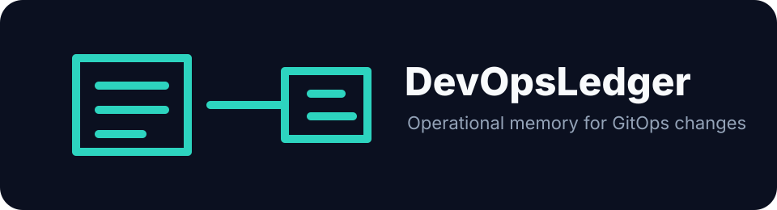

# DevOpsLedger




**Open-source operational memory for GitOps teams.**


DevOpsLedger gives platform teams a clean answer when someone asks, "Why did
this infrastructure change happen?" It connects the intent, diff, risk,
approval, rollback readiness, deployment evidence, incident aftermath, and
learning into one durable record.

The demo package is built for serious evaluation: run the API, open the web
portal, inspect the docs, and see the self-hosted path without signing up for a
SaaS account or enabling telemetry.

---

## The Problem

Platform engineering teams make hundreds of infrastructure changes a year.
Most of those changes leave no usable record. Six months later no one can answer:

- Why did this change happen?
- Who approved it?
- What resources changed?
- How risky was it?
- Was rollback actually ready?
- Did this change cause the incident three weeks later?
- What did the team learn?

Incident retros reconstruct context from Slack, PR descriptions, and memory.
That context is lost within days.

---

## The Solution

DevOpsLedger turns every infrastructure change into a **decision record**:
intent, Terraform/OpenTofu diff, risk assessment, approval, rollback readiness,
deployment event, incident correlation, and learning note.

It is not a CI/CD dashboard. It is not a ticketing system. It is the operational
memory layer that makes infrastructure changes legible - before, during, and after.

---

## Community Edition

DevOpsLedger CE is open source, self-hosted, and free. It is designed to be
genuinely useful without upgrading.

**CE features (core integrations are free):**
- [x] Infra decision records (intent, risk, approval, rollback, deployment, learning)
- [x] GitHub PR ingestion (open source + GitHub Enterprise basic)
- [x] Terraform / OpenTofu plan parsing
- [x] Argo CD basic deployment and sync events
- [x] PagerDuty incident and change webhook
- [x] Generic incident webhook
- [x] Jira issue link parsing
- [x] CODEOWNERS approval checks
- [x] Risk scoring (rules-based, YAML-configurable)
- [x] Rollback readiness scoring
- [x] Basic incident correlation
- [x] Changed resource timeline
- [x] Basic dashboard
- [x] Docker Compose deployment
- [x] Helm chart
- [x] Local / offline mode - no required outbound SaaS calls
- [x] No telemetry by default

---

## Premium (Future)

Premium will focus on hosted convenience, governance, compliance, enterprise
identity, advanced analytics, AI assistance, and support - not on gating core
DevOps functionality. Core integrations stay free.

Planned premium: DevOpsLedger Cloud, team workspaces, SSO/SAML/OIDC, SCIM,
RBAC, SOC 2 evidence exports, advanced analytics, team maturity dashboards,
AI-generated change narratives and postmortem drafts, enterprise integrations,
air-gapped enterprise bundles, enterprise support.

**Payment and subscription features are not implemented yet.**

See [docs/product-strategy.md](docs/product-strategy.md).

For the commercial path, launch angles, and first-customer profile, see [docs/go-to-market.md](docs/go-to-market.md).

---

## Self-Hosted. No Required SaaS. No Telemetry.

DevOpsLedger is on-prem first. It runs entirely without outbound SaaS calls.
All integrations are optional and disabled by default. Works in air-gapped
environments after the initial image pull.

See [docs/on-prem.md](docs/on-prem.md).

---

## Status

**MVP in progress.** Decision record CRUD, CE ingestion parsers, risk scoring,
rollback scoring, incident correlation, dashboard API, Docker Compose, and a
basic Helm chart are available.

---

## Demo Package

Each release includes a self-hosted demo package for the API, web portal, worker,
Docker Compose, Helm chart, docs, and demo GIF.

```bash
make package VERSION=v1.1.0
tar -xzf dist/devopsledger-v1.1.0-demo-package.tar.gz
cd devopsledger-v1.1.0-demo-package
cp env.example .env
DEVOPSLEDGER_VERSION=1.1.0 docker compose -f deploy/docker-compose/docker-compose.release.yml up -d
```

- API: `http://localhost:8000/health`
- API docs when `ENABLE_DOCS=true`: `http://localhost:8000/docs`
- Web portal: `http://localhost:3000`

See [docs/demo-package.md](docs/demo-package.md).

**Good evaluator flow:**

1. Start the release package.
2. Open the web portal and changed-resource timeline.
3. Hit the API health and docs endpoints.
4. Read the architecture, data model, security, and on-prem docs.
5. Confirm the default posture: offline mode on, telemetry off, integrations optional.

## Docker

```bash
docker pull ghcr.io/gerardrecinto/devopsledger/api:latest
docker pull ghcr.io/gerardrecinto/devopsledger/web:latest
docker pull ghcr.io/gerardrecinto/devopsledger/worker:latest
```

The API Dockerfile includes a `HEALTHCHECK` so Docker and orchestrators can detect startup failures without an external probe. `GET /health` returns 200 when the API is ready.

## Quick Start

```bash
git clone https://github.com/gerardrecinto/devopsledger.git
cd devopsledger
cp .env.example .env   # edit POSTGRES_PASSWORD at minimum
make up
# API:  http://localhost:8000/health
# Web:  http://localhost:3000
```

## Development

```bash
make test-api   # run API tests
make dev        # start API with hot-reload (no Docker needed)
make up         # start full stack via Docker Compose
make down       # stop
make logs       # tail logs
make build      # rebuild images
```

## Architecture

- FastAPI backend (`apps/api`)
- PostgreSQL - persistent storage
- Redis - job queue and cache
- Next.js frontend (`apps/web`)
- Background worker (`apps/worker`)
- Docker Compose (on-prem)
- Helm chart

See [docs/architecture.md](docs/architecture.md).

---

## License

MIT - Community Edition is and will remain open source.
