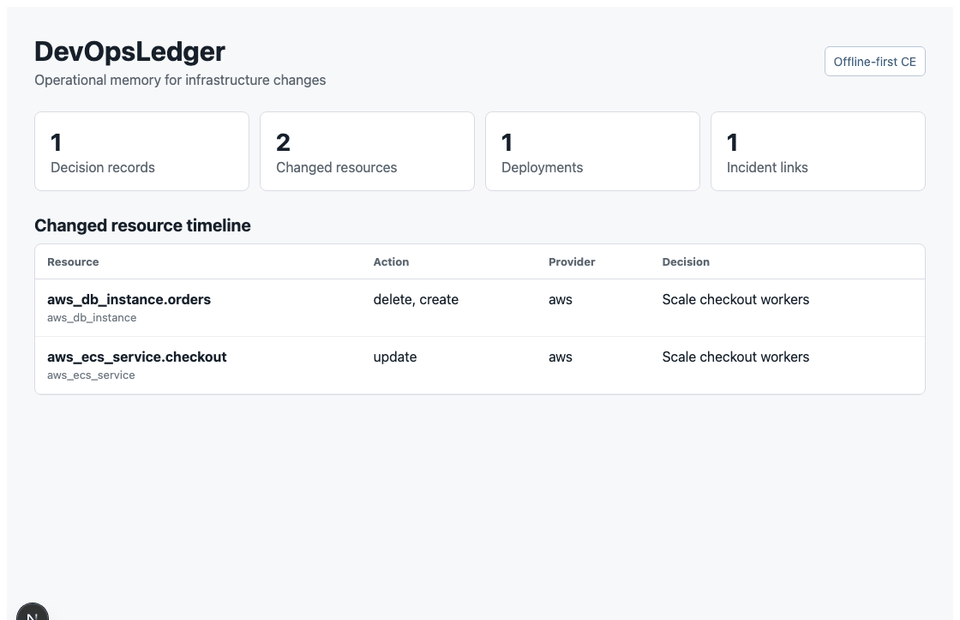

# DevOpsLedger

**Open-source operational memory for GitOps teams.**



---

## The Problem

Platform engineering teams make hundreds of infrastructure changes a year.
Most of those changes leave no usable record. Six months later no one can answer:

- Why did this change happen?
- Who approved it?
- What resources changed?
- How risky was it?
- Was rollback actually ready?
- Did this change cause the incident three weeks later?
- What did the team learn?

Incident retros reconstruct context from Slack, PR descriptions, and memory.
That context is lost within days.

---

## The Solution

DevOpsLedger turns every infrastructure change into a **decision record**:
intent, Terraform/OpenTofu diff, risk assessment, approval, rollback readiness,
deployment event, incident correlation, and learning note.

It is not a CI/CD dashboard. It is not a ticketing system. It is the operational
memory layer that makes infrastructure changes legible — before, during, and after.

---

## Community Edition

DevOpsLedger CE is open source, self-hosted, and free. It is designed to be
genuinely useful without upgrading.

**Planned CE features (core integrations are free):**
- Infra decision records (intent, risk, approval, rollback, deployment, learning)
- GitHub PR ingestion (open source + GitHub Enterprise basic)
- Terraform / OpenTofu plan parsing
- Argo CD basic deployment and sync events
- PagerDuty incident and change webhook
- Generic incident webhook
- Jira issue link parsing
- CODEOWNERS approval checks
- Risk scoring (rules-based, YAML-configurable)
- Rollback readiness scoring
- Basic incident correlation
- Changed resource timeline
- Basic dashboard
- Docker Compose deployment
- Helm chart (planned)
- Local / offline mode — no required outbound SaaS calls
- No telemetry by default

---

## Premium (Future)

Premium will focus on hosted convenience, governance, compliance, enterprise
identity, advanced analytics, AI assistance, and support — not on gating core
DevOps functionality. Core integrations stay free.

Planned premium: DevOpsLedger Cloud, team workspaces, SSO/SAML/OIDC, SCIM,
RBAC, SOC 2 evidence exports, advanced analytics, team maturity dashboards,
AI-generated change narratives and postmortem drafts, enterprise integrations,
air-gapped enterprise bundles, enterprise support.

**Payment and subscription features are not implemented yet.**

See [docs/product-strategy.md](docs/product-strategy.md).

---

## Self-Hosted. No Required SaaS. No Telemetry.

DevOpsLedger is on-prem first. It runs entirely without outbound SaaS calls.
All integrations are optional and disabled by default. Works in air-gapped
environments after the initial image pull.

See [docs/on-prem.md](docs/on-prem.md).

---

## Status

**Scaffold / MVP in progress.** Health endpoint is live. Data model and core
decision record CRUD are the next implementation slice.

---

## Quick Start

```bash
git clone https://github.com/gerardrecinto/devopsledger.git
cd devopsledger
cp .env.example .env   # edit POSTGRES_PASSWORD at minimum
make up
# API:  http://localhost:8000/health
# Web:  http://localhost:3000
```

## Development

```bash
make test-api   # run API tests
make dev        # start API with hot-reload (no Docker needed)
make up         # start full stack via Docker Compose
make down       # stop
make logs       # tail logs
make build      # rebuild images
```

## Architecture

- FastAPI backend (`apps/api`)
- PostgreSQL — persistent storage
- Redis — job queue and cache
- Next.js frontend (`apps/web`)
- Background worker (`apps/worker`)
- Docker Compose (on-prem)
- Helm chart (planned)

See [docs/architecture.md](docs/architecture.md).

---

## License

MIT — Community Edition is and will remain open source.
